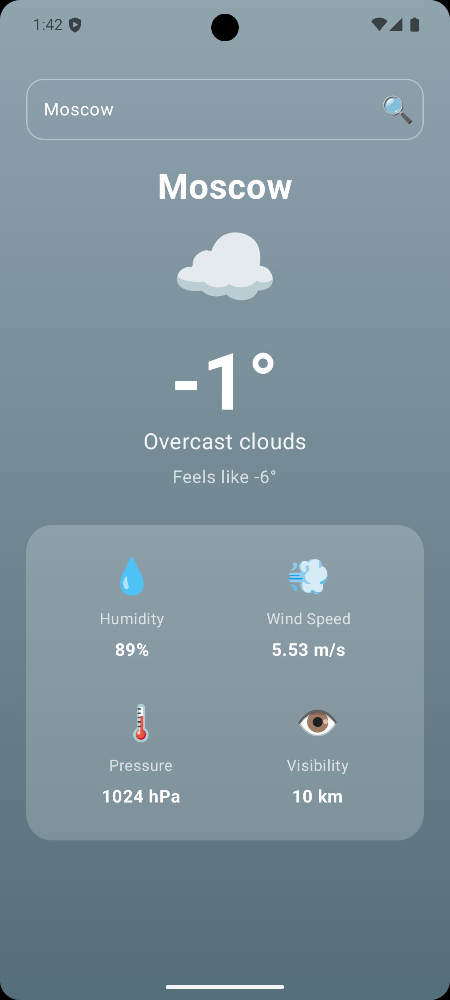
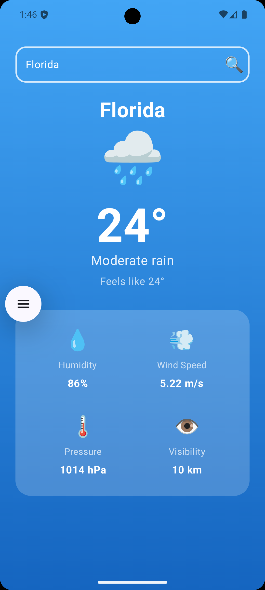
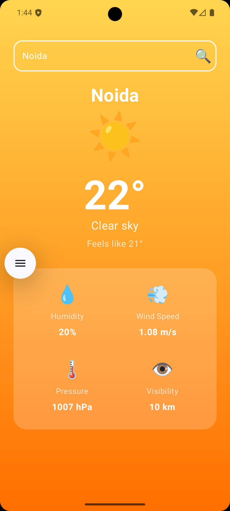

# 🌤️ WeatherApp

A modern Android weather application built with **Jetpack Compose** and **Clean Architecture**. Search any city worldwide and get real-time weather data with beautiful, dynamic gradient backgrounds that change based on weather conditions.

## ✨ Features

- 🔍 **City Search** — Search weather for any city worldwide
- 🔄 **Pull-to-Refresh** — Swipe down to refresh current weather data
- 🎨 **Dynamic Themes** — Background gradients change based on weather (sunny, cloudy, rainy, snowy, thunder)
- 📊 **Detailed Weather Info** — Temperature, feels like, humidity, wind speed, pressure, visibility
- 💾 **Offline Support** — Room database integration for data persistence

## 🏗️ Architecture

This project follows **Clean Architecture** with clear separation of concerns:

app/ ├── data/ # Data Layer │ ├── local/ # Room Database, DAOs, Entities │ ├── remote/ # Retrofit API, DTOs │ └── repository/impl/ # Repository Implementations ├── domain/ # Domain Layer (Pure Kotlin) │ ├── model/ # Business Models │ ├── repository/ # Repository Interfaces │ └── usecase/ # Use Cases ├── presentation/ # Presentation Layer │ ├── ui/home/ # Compose Screens │ ├── ui/theme/ # Theme, Colors, Typography │ └── viewmodel/ # ViewModels └── di/ # Dependency Injection ├── component/ # Dagger Components └── module/ # Dagger Modules

## 🛠️ Tech Stack

| Category | Technology |
|---|---|
| **UI** | Jetpack Compose, Material 3 |
| **Architecture** | Clean Architecture, MVVM |
| **DI** | Dagger 2 |
| **Networking** | Retrofit, OkHttp, Gson |
| **Database** | Room |
| **Async** | Kotlin Coroutines, StateFlow |
| **API** | OpenWeatherMap |

## 📸 Screenshots

<p align="center">
  
  
  
</p>


## 🚀 Setup

1. Clone the repository
   ```bash
   git clone https://github.com/thekishanjha/WeatherApp

2. Get a free API key from OpenWeatherMap

3. Add your API key to local.properties:
 WEATHER_API_KEY=your_api_key_here

4. Build and run the project in Android Studio

